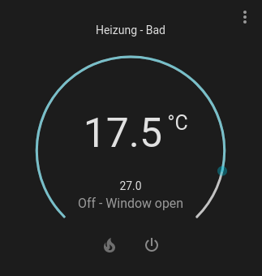
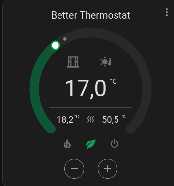
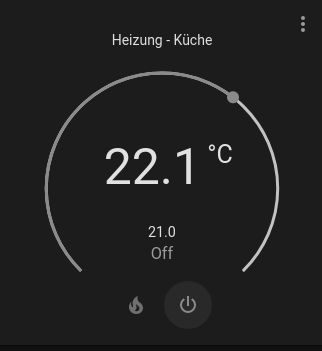
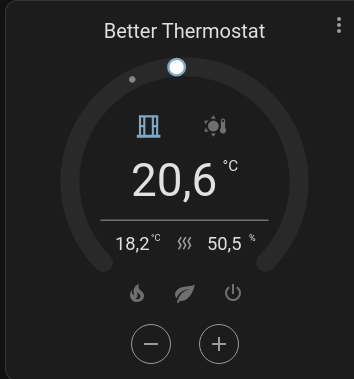

# Better Thermostat UI for ai_thermostat

This project is in a early stage of development. Its a 1:1 adaption of the default HA Thermostat Card, but with some improvements for the custom [ai_thermostat](https://github.com/KartoffelToby/ai_thermostat) integration. (you need at least 0.8.5)

As for now the main improvment is the ability to see the extra status from ai_thermostat like if a window open is deteteced, or nightmode is on or summer mode.

 
## Goals

- [X] Add ai_thermostat support for showing the extra status
- [ ] Improve the UI for Touch devices
- [ ] Show also the Humidity in the UI

## Options

| Name                 | Type    | Default      | Description                                                                                            |
| -------------------- | ------- | ------------ | ------------------------------------------------------------------------------------------------------ |
| type                 | string  | **Required** | `custom:better-thermostat-ui-card`                                                                          |
| entity               | string  | **Required** | The entity id of climate entity (must be a ai_thermostat entity). Example: `climate.hvac`                                               |

## Help wanted!

It would be awsome if you help me to translate this card to other languages.

Create a PR, the Translation is done in json files checkout the en translation [here](src/localize/languages/en.json)

What we have so far:
- EN
- DE
- FR
- RU
- PL
- SK
- DA
- HU
- ES
- TR

## Support me

